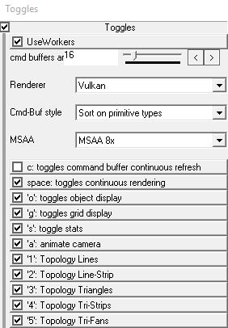
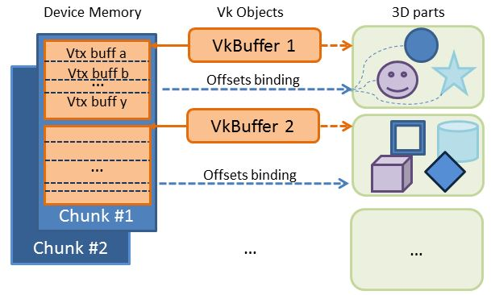
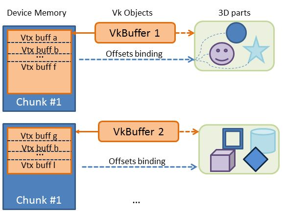
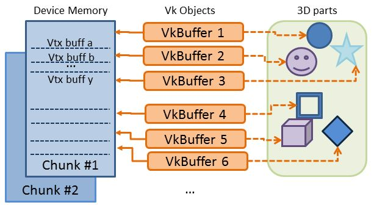
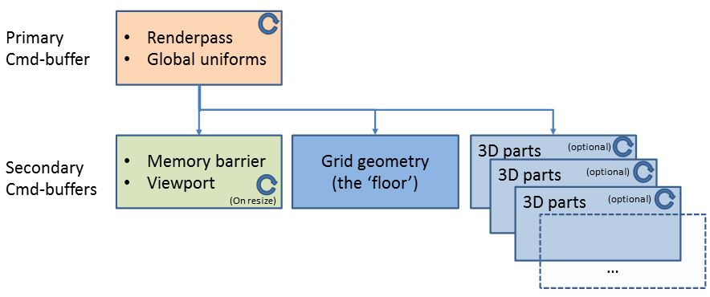
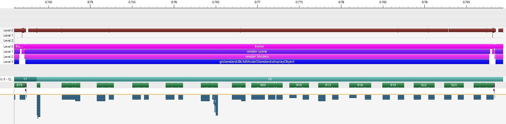
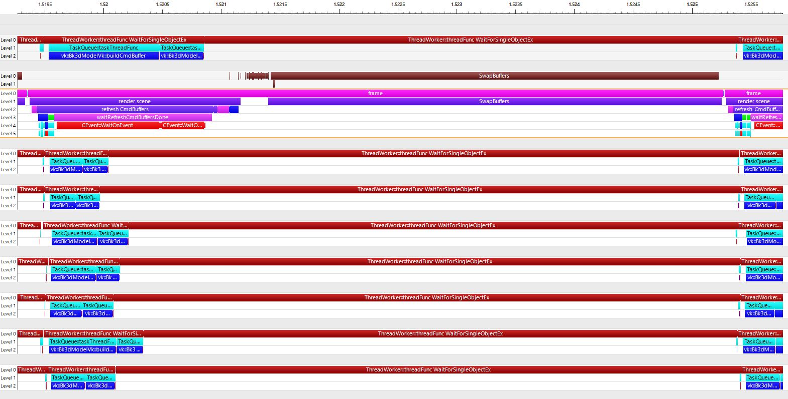
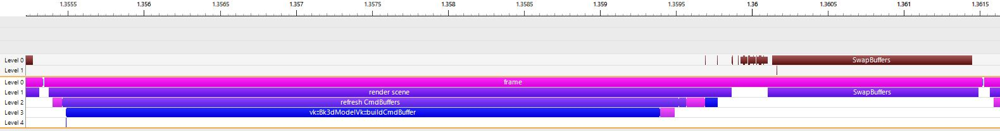

> Author: Tristan Lorach (tlorach@nvidia.com)
> - February 17th 2016

# Vulkan & OpenGL & Command-list Sample using "Thread-Workers"

With the official release of Vulkan, NVIDIA and the "Devtech-Proviz" Team released new samples on [professional graphics repository](https://github.com/nvpro-samples). 

The Purpose of this Blog post is to give more details on what is happening in the Sample called `gl_vk_bk3dthreaded` [(available here)](https://github.com/nvpro-samples/gl_vk_bk3dthreaded).

## How to build the sample
For now, I am sorry to say that the sample might only run on Windows. I didn't consolidate it for Linux, yet.

This sample requires the following:

- LunarG SDK v1.0.3.1 : just install it from https://vulkan.lunarg.com : cmake should be able to locate it
- [shared sources](https://github.com/nvpro-samples/shared_sources) : this folder contains few helper files and additional cmake information needed to build the project
- [shared external](https://github.com/nvpro-samples/shared_external) : this folder a is a convenient way to gather all external tool that our samples rely on. Rather than trying to find back the right versions of zlib, AntTweakbar etc, this folder contains all the needed external projects that our samples need:
	- zlib: to read gz files (3D model(s) )
	- SvcMfCUI: a simple UI based on Windows MFC. No fancy but convenient
	- AntTweakBar (not used in this sample... yet. SvcMfCUI used instead)
	- Optionally: NSight nvTX custom markers
-  the submarine model: when you will configure the project with cmake, cmake script will perform a *wget* to get the model and store it locally: `MODEL_DOWNLOAD_SUBMARINE` Checked. The model is 32Mb and will be stored in a shared folder called `downloaded_resources`

Optionally, be aware that other *bk3d* models could be used in this sample. But to avoid heavy download, only the submarine will be taken by default. Check `MODEL_DOWNLOAD_MORE` On for more models...  

## How does the sample work

The sample will run by default with the *submarine* model *and some camera animation*. So if you want to freely move the camera, don't forget to stop the animation (UI or 'a' key) 

If you give as cmd-line argument another model (*.bk3d.gz or *.bk3d), the sample should be able to render it but the animation will be turned off; and it is possible that the camera won't focus exactly over the new model...

Vulkan renderer will be the default one at startup. You can switch between:

- **OpenGL & Command-lists**: an example on how to feed the token-buffers
- **OpenGL**: a basic implementation of how would you render 3D with OpenGL
- **Vulkan**: the default renderer

> **Note**: toggles are preceded by a character between quotes: when the viewport has the focus, you can use the keyboard instead. 

- **Use Workers**: checked for multi-threading. Unchecked: only the main thread will update the draw commands (cmd-buffers)
- **command-buffer amount**: by default, 16 secondary command-buffers will be created to render everything. In the multi-threading case, thread-workers will get spawned and will work on building them: when **'c'** toggle is checked (*command-buffer continuous refresh*)
- **Cmd-buf-style**: this model came from a CAD application. It turns out that at the time this model was created, primitives were issued depending on their 'parts', rather than depending on their primitive type and/or materials (hence shaders). **"sort on primitive type"** would allow to first render triangles; then strips; then lines...
-  **MSAA**: Multispampling mode
- 'c', &g_bRefreshCmdBuffers, "c: toggles command buffer continuous refresh\n");
- <space-bar>, &m_realtime.bNonStopRendering, "space: toggles continuous rendering\n");
- toggles from 'o'to '5' are obvious options... just give a try

###cmd-line arguments

- -v (VBO max Size)
- -m (bk3d model)
- -c 0 or 1 : use command-lists
- -o 0 or 1 : display meshes
- -g 0 or 1 : display grid
- -s 0 or 1 : stats
- -a 0 or 1 : animate camera
- -d 0 or 1 : debug stuff (ui)
- -m (bk3d file) : load a specific model
- (bk3d file name)    : load a specific model
- -q (msaa) : MSAA

### mouse
special Key with the mouse allows few to move around the model. The camera is always targeting a focus point and is essentially working in "polar coordinates" (**TODO**: I need to display the focus point with a cross...)

- **mouse wheel**: zoom in/out from the focus point
- **left mouse button**: rotate around the focus point
- **right mouse button**: rotate around Ox axis and zoom in/out from focus point
- **right mouse button + Ctrl**: will push forward/backward the focus point 
- **middle mouse button**: pan left/right up/down the focus point along camera axis
- **arrows**: rotate around the focus point
- **Pg-up/Pg-down**: zoom in/out
- **Pg-up/Pg-down + Ctrl**: push forward/backward the focus point along camera axis

## Features exposed in the sample

Hopefully, you might find few interesting details in this sample. Here are the key items that could draw you attention:

1.  Comparisons between the 3 rendering modes
2.  multi-threaded sample using a mechanism based on "Thread-workers", and how to use Vulkan in this case
3. helper file that allows to write Vulkan code in a more compact fashion
4. Spir-V compilation included in cmake project
5. Various Vulkan practices that are necessary to make things run
6. `GL_NV_draw_vulkan_image` extension: a nice NVIDIA-specific way to mix Vulkan with OpenGL

### 3D model
the 3D model comes from a *pre-baked* format (see [here](https://github.com/tlorach/Bak3d) ). There is no value to understand how it is working: main interest is that it loads fast (baked format... saving us parsing time) and that I managed to 'capture' some models as they were issued by various applications.

The sample will load the model, then attach it to the renderers. The resource creation will thus depend on which Graphic API is being used. 

### rendering modes
This is a simple sample, so I took the liberty to make the shader-system extremely simple: only 3 fragment shaders are in involved: one for the grid; one for lines; the other for filled primitives. So I cannot claim showcasing complex use-case made of tons of shaders as it often happens. On the other hand, it might allow the sample to keep simple... 

In any renderer, we are trying to be efficient: the model contains lots of transformations as well as lots of materials. Rather than updating them on the flight (by updating uniforms, for example), we will generate *arrays of materials* and *arrays of transformations*. Then we will bind the right buffer offsets thanks to:

* `glBindBufferRange` for OpenGL
* *Bindless pointers* for Command-lists
* `vkCmdBindDescriptorSets` offset argument for Vulkan

In many cases, especially for OpenGL, 'bucketing' Primitives and/or grouping them according to their shaders allows greater performance than taking primitives as they come. Although Vulkan & Command-lists adds lots of tolerance over the amount of state transition in their command buffers, it is better practice to avoid overloading them too much.

## vulkan renderer
Vulkan renderer is located in `bk3d_vk.cpp` file:

- `RendererVk` is the class for the renderer
- `Bk3dModelVk` is the class for the model being rendered

### Initialization of resources

`RendererVk::initGraphics` will setup most of the Vulkan objects and related memory

Vulkan requires you to manage memory as much as possible. Of course you can rely on driver memory allocation ( `vkAllocateMemory` ), but better practice is to allocate memory with `vkAllocateMemory` in larger chunks and later take care about partitioning what is inside.

few possibilities to reach the right resources:

1. bind many VkBuffers or images at various offsets of the device memory chunk (`vkBindBufferMemory`...)
2. or use the binding offsets available in `vkCmdBindVertexBuffers` or `vkCmdBindIndexBuffer` or `vkCmdBindDescriptorSets` to reach the right section in the current buffer
3. Or a mix of both!

Note that in a real situation, more chunks of memory would be allocated: when previous ones are full, the engine might create a new one; and in a real situation, the application should have a more clever heap management from what gets allocated to what gets freed in chunks of memory.  

Ideally, the memory areas are a mix of buffers mapped to various offsets, while drawcalls do also use offsets withing buffers that are active:

This sample doesn't implement this general case, but implements both of the 'extreme' cases:

the default one (see `#define USE_VKCMDBINDVERTEXBUFFERS_OFFSET`) will allocate *one VkBuffer for one chunk of Device Memory*; then offsets will be maintained for the 3D parts to find back their vertices/indices

the other approach will 'forget' about offsets in buffers and will naively create a VkBuffer for each required VBO/IBO. But a basic allocator will bind these buffers to the right offsets in the device memory chunk. 

It turns-out that, out of demonstrating how to bind buffers at different areas of a device memory, the latter approach could rapidly reach the limits of available objects (here VkBuffer). This is precisely what happened to me once, with a big model from a CAD application...

In other words, it is not a good idea to blindly use object handles only: there are good reasons for why the *offset* parameter in command-binding exist. The renderer should be clever enough aggregate small buffers together thanks to the offset-binding in the command-buffer creation. The best solution would be *to mix both, depending on the requirements of the engine*.

### Initialization of Vulkan components
This section should be self-explanatory. Essentially the idea is to prepare things up-front, as much as possible (in fact: everything, except command-buffers) so that the *rendering loop doesn't involve any sort of expensive validation*. 

Validation is what made OpenGL so tricky: the state-machine of OpenGL tends to transform the driver into a *paranoid state* where it can never really know or guess what exactly is the application doing: everything is possible at any time and the driver must be ready for this!

Vulkan on the other hand expects the opposite: the developer must exactly know what he'll use. He must prepare things so that Vulkan driver doesn't have to worry anymore on un-expected situations.

This section will setup the following components:

- **Spir-V shaders** (*.spv)
- **semaphores** for glDrawVkImageNV synchronization
- a combination of various **Graphics-Pipelines**: One for 'lines' primitives; one for triangle-fans; another for triangle lists...
- **Sampler(s) and Texture(s)** (Note that I do load a Noise DDS texture but the latest shaders don't use it, finally...) 
- **general Uniform buffer**: needed for Projection/view dependent matrices, for example
- **descriptor-set layouts**: how the descriptor-sets are put together for various situations. You can see the Descriptor-Set layout as a way to reduce the scope of resource addressing: a layout that allows the driver to identify the scope of which memory pointers need to be set for a given situation.
- **pipeline-layout**: created from the *descriptor-set layouts*
- a list of states we want to **keep dynamic** (meaning they can be modified from withing a command-buffer): Viewport and scissors etc.
-  a **Descriptor-Pool** and some **Descriptor-Sets**: we will associate some resources to some descriptor-sets
-  **Fences** for command-buffer update (later below)
-  **Render-Pass** and its sub-pass(es)
-  **Frame-buffer** to associate with the Render-Pass 
-  Vulkan **timer** initialization

### Initialization of Command-Buffer Pools
*Command-buffer Pools must be created per thread*: the allocation/deallocation of command-buffers can only be performed in a concurrent manner if each thread owns its own allocation pool. In our sample, we will use the **TLS** (Thread Local Storage) for each thread to refer to his own pool.

The main initialization function will issue a series of calls to each thread in order to have them store their command-buffer pool in their own TLS (see `initThreadLocalVars`)

### Command-Buffers
Vulkan introduced the concept of **primary** and **secondary** command-buffers. The idea behind is to allow a more generic primary command-buffer to call secondary ones that would contain more details about the scene. Note that Vulkan restricted the hierarchy to only 2 levels.

Command-buffer usage is rather flexible. In our case, we will use various command-buffers with the idea that:

- for every frame, we will re-create the *primary command-buffer*
- *secondary command-buffers* might be created every frame or recycled: it is optional (see 'c' option in the UI)
- secondary command-buffers are used for specific purposes: 
	- one for *memory barrier* and *viewport setup*: this buffer will be created/updated *only when the viewport size changed*
	- another one for the grid of the floor: this command-buffer can also be very static and can be created once and for all...
	- finally other secondary command-buffers are used to render the geometry of the scene

 
I mentioned earlier in the "initialization section" the creation of **Fences**.

As a reminder, the GPU is a co-processor that we want to fill with tasks in parallel with what a CPU would do on its side. Because we really want both of them to work in parallel, it is bad to 'serialize' the CPU with the GPU. Neverthelessm, it is still necessary to synchronize them at various critical steps.

The update of command-buffers is one of them: After we generated a bunch of command-buffers, we will en-queue them for the GPU to consume them. But it is possible that the CPU already looped back to the next frame for command-buffer creation, and this *before* the GPU was finished with the previous batch of command-buffers.

One naive solution is to wait for the GPU to be done and finally recycle the command-buffers for the next iteration. But waiting for the GPU would a be waste...

The *ideal solution* would be to allocate new command-buffers for the next frame so that we don't wait for GPU completion. Later, the consumed command-buffers should be identified and put back to the pool (garbage collection).

This sample is doing a bit of the latter: using a 2 caches of command-buffers and doing a **"Ping-pong"** transaction: 

- while GPU is dealing with cache #1; we will check the completion of cache #2 thanks to the Fence #2;
- most of the time it might be ready; worst case: a bit of wait.
- When ready, we will Free the command-buffer from cache #2
- then we would Allocate new command-buffers in this cache #2, while GPU finishes to consume what is in cache #1
- Then we will enqueue the new cmd-buffers from cache #2 to the GPU, tagged with Fence #2
- Next frame, the CPU will check the Fence #1, to see if the GPU was done with it (normally it should... GPU would have already started to consume cmd-buffers from cache #2)
- etc.

This approach cannot allow building more than 1 frame ahead (in fact, many games artificially limit the # of frames ahead: to prevent lagging in game controls. Frame-ahead are Good for Benchmarks... not so good for gaming experience ;-). 

I suppose that a more generic approach would be to use a **ring-buffer** or a **command-buffer 'garbage' collector**, rather than limiting ourselves to 2 slots (ping-pong). Next revision of the sample might have a better approach...

### Blit to OpenGL back-buffer: `GL_NV_draw_vulkan_image`

The driver team introduced a convenient way to mix Vulkan rendering with an existing OpenGL context associated with the window.

Normally, **WSI** should be the way to work with Vulkan: dealing with a swapchain; associating it with the windows surface etc.

The interesting part of GL_NV_draw_vulkan_image is that it can spare you the work of setting up WSI; but more importantly is allows you to **mix Vulkan with openGL**. As an example: most of our samples are currently running Vulkan with an overlay in OpenGL: **AntTweakBar** or any other UI overlay is are still in OpenGL. If we didn't have this feature, No overlay would have worked right away and would have required quite some time to port...

GL_NV_draw_vulkan_image requires 2 **semaphores**:

- one that will be signaled as soon as the blit of the Vulkan image to the backbuffer is done (`m_semOpenGLReadDone` in the sample)
- the other one to be signaled by the Queue (`vkQueueSubmit`) when the GPU finally finished the rendering (`m_semVKRenderingDone` in the sample)

    	nvk.vkQueueSubmit( NVK::VkSubmitInfo(
    	  1, &m_semOpenGLReadDone,			// <== might make the queue wait to be signaled
    	  1, &m_cmdScene[m_cmdSceneIdx],
    	  1, &m_semVKRenderingDone),		// <== might make the copy to OpenGL to wait
    	  m_sceneFence[m_cmdSceneIdx] );`

The sample will call `RendererVk::blitToBackbuffer()` at the end for the final copy to the OpenGL backbuffer:

    glWaitVkSemaphoreNV((GLuint64)m_semVKRenderingDone);
    glDrawVkImageNV((GLuint64)m_colorImage.img, 0, 0,0,w,h, 0, 0,1,1,0);
    glSignalVkSemaphoreNV((GLuint64)m_semOpenGLReadDone);
 
## Vulkan code
This previous source code snippet reveals a weird syntax that is not native to Vulkan...

`NVK.h` and `NVK.cpp` contain an experimental overlay that turns many (ideally, all) structures of Vulkan to simple Classes made of **constructors** and occasionally **functors**.

My purpose was to find a way to lower the amount of C code required to fill all these Vulkan structures: To be honest I was quite scared the first time I saw Vulkan include file!

>
**Note**: I don't claim this is an ideal solution. Not even sure that it makes the code more readable. But I wanted to try it through few samples and stress the idea. Feedback or better ideas are most welcome.

The best examples are in the source code of `bk3d_vk.cpp`. But here is a simple example:

When creating a **Vertex Input State**, there are a bunch of nested structures to put together in order to finalize the description.

constructors and functors are interesting because they can turn C/C++ code into some sort of *functional* programming, where declarations are nested into one another and don't require *explicit temporary storage*.

Besides, they need less space in the code and can even have default argument values.

    NVK::VkPipelineVertexInputStateCreateInfo vkPipelineVertexInputStateCreateInfo(
        NVK::VkVertexInputBindingDescription    (0/*binding*/, 2*sizeof(vec3f)/*stride*/, VK_VERTEX_INPUT_RATE_VERTEX),
        NVK::VkVertexInputAttributeDescription  (0/*location*/, 0/*binding*/, VK_FORMAT_R32G32B32_SFLOAT, 0            /*offset*/) // pos
                                                (1/*location*/, 0/*binding*/, VK_FORMAT_R32G32B32_SFLOAT, sizeof(vec3f)/*offset*/) // normal
    );

> **Notes**: `VkVertexInputBindingDescription` pretty much corresponds to **D3D10 Slots** : a way to group interleaved attributes together in one buffer. You can have many of these 'Slots'
> `VkVertexInputAttributeDescription` corresponds to the attribute that lives in one of these slots, Hence the reference to the binding

In this example, the structure `VkPipelineVertexInputStateCreateInfo` is filled with parameters without the need to declare any temporary intermediate structure, to then pass its pointer:

- `NVK::VkVertexInputBindingDescription` constructor directly creates a local instance of the structure; which obviously will be destroyed with `vkPipelineVertexInputStateCreateInfo`
- if there were more than one Input-binding, a functor with the same arguments as the constructor would be added right afterward. This is what happens with the next class:
- `NVK::VkVertexInputAttributeDescription` is needed for more than one attribute: position and normal
	- the first tuple `(0, 0, VK_FORMAT_R32G32B32_SFLOAT, 0)` is its **constructor**
	- the second tuple `(1, 0, VK_FORMAT_R32G32B32_SFLOAT, sizeof(vec3f))` is its **functor**
	- if there was more than 2 attributes, *another functor* would follow, etc.  

>**Note**: I tried to *avoid 'shortcuts'* and keep the *original names* and structures so there is less confusion when translating Vulkan structures to this kind of writing.

Another example I find particularly nicer to read is for the **RenderPass** creation:

    NVK::VkRenderPassCreateInfo rpinfo = NVK::VkRenderPassCreateInfo(
        NVK::VkAttachmentDescription
            (   VK_FORMAT_R8G8B8A8_UNORM, (VkSampleCountFlagBits)MSAA,                                        //format, samples
                VK_ATTACHMENT_LOAD_OP_CLEAR, VK_ATTACHMENT_STORE_OP_STORE,          //loadOp, storeOp
                VK_ATTACHMENT_LOAD_OP_DONT_CARE, VK_ATTACHMENT_STORE_OP_DONT_CARE,  //stencilLoadOp, stencilStoreOp
                VK_IMAGE_LAYOUT_UNDEFINED, VK_IMAGE_LAYOUT_COLOR_ATTACHMENT_OPTIMAL //initialLayout, finalLayout
            )
            (   VK_FORMAT_D24_UNORM_S8_UINT, (VkSampleCountFlagBits)MSAA,
                VK_ATTACHMENT_LOAD_OP_CLEAR, VK_ATTACHMENT_STORE_OP_STORE,
                VK_ATTACHMENT_LOAD_OP_CLEAR, VK_ATTACHMENT_STORE_OP_STORE,
                VK_IMAGE_LAYOUT_UNDEFINED, VK_IMAGE_LAYOUT_DEPTH_STENCIL_ATTACHMENT_OPTIMAL
            )
            (   VK_FORMAT_R8G8B8A8_UNORM, (VkSampleCountFlagBits)1,                                        //format, samples
                VK_ATTACHMENT_LOAD_OP_CLEAR, VK_ATTACHMENT_STORE_OP_STORE,          //loadOp, storeOp
                VK_ATTACHMENT_LOAD_OP_DONT_CARE, VK_ATTACHMENT_STORE_OP_DONT_CARE,  //stencilLoadOp, stencilStoreOp
                VK_IMAGE_LAYOUT_UNDEFINED, VK_IMAGE_LAYOUT_COLOR_ATTACHMENT_OPTIMAL //initialLayout, finalLayout
            ),
        // many sub-passes could be put after one another
        NVK::VkSubpassDescription
        (   VK_PIPELINE_BIND_POINT_GRAPHICS,                                                                        //pipelineBindPoint
            NVK::VkAttachmentReference(),                                                                           //inputAttachments
            NVK::VkAttachmentReference(0/*attachment*/, VK_IMAGE_LAYOUT_COLOR_ATTACHMENT_OPTIMAL/*layout*/),        //colorAttachments
            NVK::VkAttachmentReference(2/*attachment*/, VK_IMAGE_LAYOUT_COLOR_ATTACHMENT_OPTIMAL/*layout*/),        //resolveAttachments
            NVK::VkAttachmentReference(1/*attachment*/, VK_IMAGE_LAYOUT_DEPTH_STENCIL_ATTACHMENT_OPTIMAL/*layout*/),//depthStencilAttachment
            NVK::Uint32Array(),                                                                           //preserveAttachments
            0                                                                                                       //flags
        ),

Of course there is not magic and what you don't do yourself is done behind the scene (check `class VkPipelineVertexInputStateCreateInfo` for example). One could argue that it would be even more expensive than using regular Vulkan structures... But let's not forget that this part of the code is happening at **initialization time**... so does it really matter ?

Now, more attention should be brought when dealing with the *main rendering loop*...

## Multithreading: Thread-Workers

The source code of the sample containing Vulkan and OpenGL source code is **not** especially designed to be multi-threaded.

To be more specific, the *only* declaration that suggests multi-threading is `NThreadLocalVar` template: to allow TLS (Thread Local Storage) to happen...

All the rest of the multi-threading happens in the main sample file `gl_vk_bk3dthreaded.cpp`.

In other words, some methods of OpenGL or Vulkan renderers become multithreaded because *they got wrapped by dedicated Class*, making them multi-threaded.

### Thread-Workers job assignment
To assign a job to a worker, you must declare a specific Class, where:

- the *constructor* will become the receiver for **the function arguments**
- the worker will start his job through a specific method: `Invoke()`

This approach allows to prepare function arguments so that they are ready for later use: when the thread will finally be kicked-off by the thread-worker manager.
Generic example:

    class TskXXX : public TaskBase
    {
    private:
        int arg1;
        int arg2;
    public:
        TskUpdateCommandBuffer(int _arg1, int _arg2)
        {
            arg1 = _arg1; arg2 = _arg2;
        }
        virtual void Invoke()
        {
            s_pCurRenderer->SomeMethod(arg1, arg2);
        }
    };
 
To execute this job, we can queue workers for TskXXX as follow:

    for(int n=0; n<100; n++)
    {
        // worker will be deleted by the default method Done()
        TskXXX *tskXXX = new TskXXX(10, 2);
        g_mainThreadPool->pushTask(tskXXX);
    }

`g_mainThreadPool` is the main thread Pool manager that god initialized as follow:

    g_mainThreadPool = new ThreadWorkerPool(NUMTHREADS, false, false, NWTPS_ROUND_ROBIN, std::string("Main Worker Pool"));

### Workers for command-buffer creation

for more details, one of the most important part of multi-threading in this sample is in `refreshCmdBuffers()`

Here is what multi-threaded command-buffer updates do:

- walk through the 3D model and split it in equal parts (almost...)
- push a Worker for the command-buffer creation of this part ( `g_mainThreadPool->pushTask(tskUpdateCommandBuffer)` )
- workers will execute in specific thread: what the worker-manager (`g_mainThreadPool`) will chose for you
- each worker will signal an *event* object when it finished the command-buffer creation
- the main thread in the meantime will have to wait for all to be done: looping into all the *event objects*
- Once secondary command-buffers are ready, the main thread will put them together in the primary command-buffer: . This task is not supposed to take time

## Results

- **Vulkan static**: means we render with Vulkan but command-buffers for geometry is never updated. The scene is made of **static meshes**
- **Vulkan dynamic 16 workers**: command-buffers are all built during each frame, like if it required constant update or change. Typic for dynamic scenes. 16 workers involved
- **Vulkan dynamic 1  worker**: same above but like if no multi-threading involved
- **OpenGL**: regular OpenGL. It pretty much corresponds to a dynamic scene, because OpenGL *requires you to update render-states and drawcalls each frames* (except for Display-Lists)
- Cmd-Lists static: assuming we created once all the **token-buffers**. Scene is static
- Cmd-Lists dynamic 16 workers: re-building the token buffers each frame in multithread
- Cmd-Lists dynamic 1 worker:re-building the token buffers each frame with one thread

rendering mode              | GPU time | CPU time [ms]| 
--------------------------- | -------- | -------- |
Vulkan static               |      5.7 |    0.688 |
Vulkan dynamic 16 workers   |      5.7 |     3.0  |
Vulkan dynamic 1  worker    |      5.7 |     5.2  |
                            |          |          |
OpenGL                      |      9.9 |     9.4  |
                            |          |          |
Cmd-Lists static            |      5.0 |    0.097 |
Cmd-Lists dynamic 16 workers|     40.0 |     40.0 |
Cmd-Lists dynamic 1 worker  |     20.0 |     20.0 |

Vulkans shows as expected that it performs very well in multi-threaded mode. this model may not be the best use-case for multi-threading, but we can already see that workers allows parallel processing, almost dividing by 2 the amount of time required.

**OpenGL is driver limited**: the fact that a lot of state changes and drawcalls are required for each frame doesn't leave much room (none, in fact) for *more CPU processing*. So if the engine had to perform some *Physic simulation over the scene*, the performances would *drop even more*. On the other hand, Vulkan left some room for the CPU to process additional tasks: the frame-rate could stay the same with more processing !

Command-lists are the best for static scenes. It makes sense because the token-buffers are really very close to the GPU front-End. So the *driver has nearly nothing to do*.

On the other hand: as soon as we want to make command-lists dynamic, things get complicated and way less efficient. However:

- there must be a **bug** (sorry) in the multi-threaded command-list approach. Even though it may not be as efficient as Vulkan, it shouldn't be as bad... to be continued in upcoming github updates :-). But in a way, this bug shows one thing: it *shows that Command-lists in multithreaded mode is not as straightforward as Vulkan API*. Even if it might be possible to get good performances, the source code could become hard to maintain. 
- Command-lists are in OpenGL API. And OpenGL is really bad for multi-threading. In this sample, the token-buffer creation in thread-workers is absolutely not dealing with OpenGL. It means that it postponed the stitching of token-buffers to later, by the main thread.

### NSight captures

Here is an image of NSight Custom-markers when using OpenGL

You can see the expected "display" function where 

- in the bottom: the cascade of GPU commands pipelined through the GPU
- on the top, the brown line: a very dense series of OpenGL commands for state changes, buffer-binding and drawcalls. It shows how busy is the display() function in issuing commands to OpenGL. It shows how much the CPU is involved in this task (including the driver)
 

----------

Here is an image of NSight Custom-markers when Vulkan is using thread-workers.

You can see how much rooms is available for anything else on the CPU: the 8 thread finished very quickly the command-buffer update. Not only the main thread could do something while waiting for other threads to build command-buffers, but more thread workers could be allocated onto the 8 threads available.

----------

And here is an NSight capture when Vulkan is only using the main-thread. 

Despite the fact that the framerate is the same, there is not much room for more CPU processing. Now, one could argue that 8 additional threads could be used in parallel for other tasks, too. 

This is true: multi-threading can offer a wide range of possibilities. It all depends on what kind of design is needed...

And what is really exciting with Vulkan is exactly this kind of flexibility that many engineers have patiently been waiting for some time. Now the challenge is to make good use of this strength... it may not be always easy.